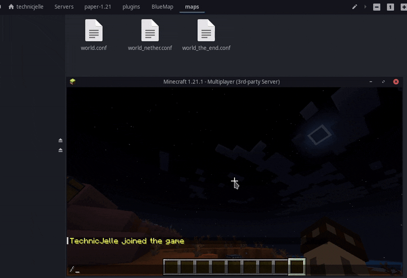
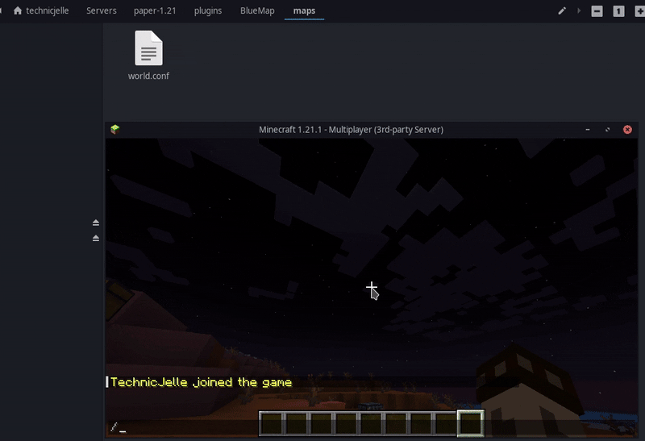

# BlueMap New Map

[](https://github.com/TechnicJelle/BlueMapNewMap/releases/latest)
[](https://bstats.org/plugin/bukkit/BlueMap%20New%20Map/23860)

This is a tiny addon for BlueMap, with which you can more easily create new maps.

It has just a single command:
```
/bm-newmap <world> <map-name>
```

This will create a new BlueMap map with the given name as both the name and the ID.
The server will automatically detect the dimension and world path from the world name.

This command can only be used by OP players, or players with the permission `bm-newmap`.

This is a [Paper](https://papermc.io/) plugin. It supports Minecraft 1.13 and newer.

## [Click here to download!](../../releases/latest)

## Support

To get support with this plugin, join the [BlueMap Discord server](https://bluecolo.red/map-discord) and ask your
questions in [#3rd-party-support](https://discord.com/channels/665868367416131594/863844716047106068). You're welcome to
ping me, @TechnicJelle.

## Demo



I create a map called `Overworld` of the world `world`.\
This is the second map of the same world, because this is a thing you can do.\
Just like in real life, many different maps exist of our one beautiful planet Earth.

---



Here, the server has three worlds: `world`, `world_nether`, and `world_the_end`,
but only the (over)world has a map.\
So, I create a map called `nether` of the world `world_nether`
and a map called `the_end` of the world `world_the_end`.
